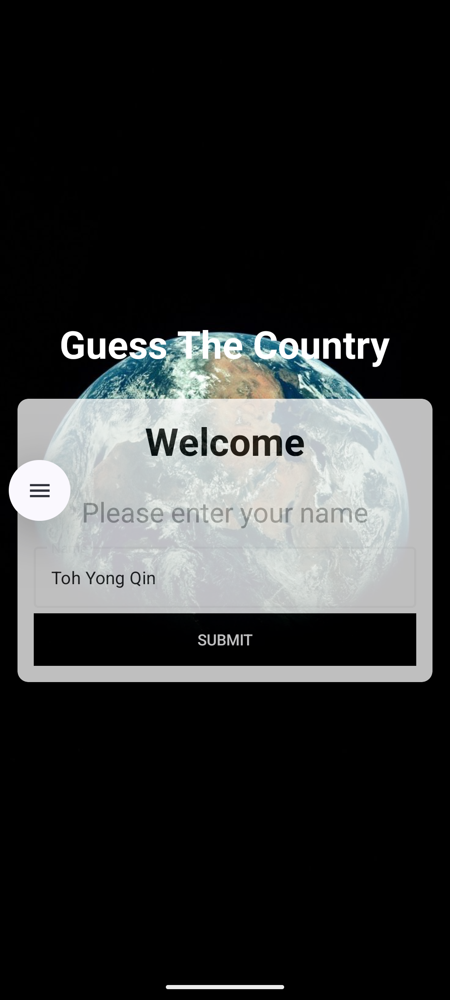
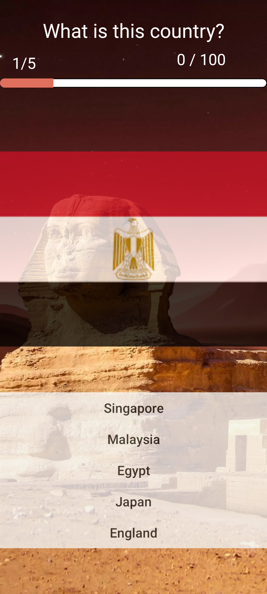
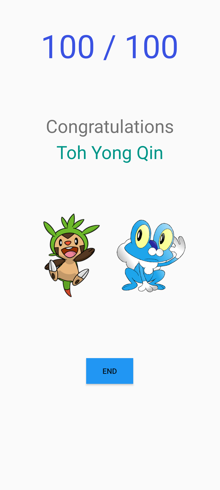

<h1>Guess The Country Android 1.0.0</h1>

<ul>
  <li>
    <h4>
      This application is developed using:
    </h4>
      <ol>
        <li>Android Studio Otter 2025.2.1.8</li>
        <li>kotlin v2.3.10</li>
        <li>java v21</li>
      </ol>
  </li>
  <li>
    <h4>
      This application is <b>activity based</b>, whereby each activity is derived from the <b>ComponentActivity class</b> and each activity has different <b>content layout view</b>.
    </h4>
  </li>
  <li>
    <h4>
      Navigating each activity using <b>Intent class</b>.
    </h4>
  </li>
</ul>

<h1>Application Snapshots</h1>
<ul>
  <li style="display: inline">
    <h4>Home Page</h4>
    
  </li>
  <li style="display: inline">
    <h4>Quiz Page</h4>
    
  </li>
  <li style="display: inline">
    <h4>Congratulations Page</h4>
    
  </li>
</ul>
